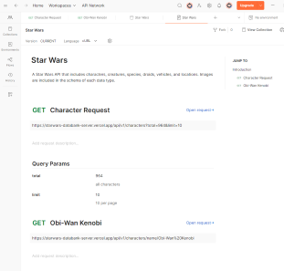

# Mustafetch - Star Wars Character Search

A Star Wars character search app, named after the planet Mustafar!

## Features and Function

- Data pulled from the [Star Wars Databank API](https://starwars-databank.vercel.app/)

- The base url: ```https://starwars-databank-server.vercel.app/api/v1/```

    

- Search bar function to search characters by name, built with JavaScript
- Card that displays character name, description, and photo
- Styled with Tailwind CSS
- [Unsplash](https://unsplash.com/) for hero stock photo
- [Font Awesome](https://fontawesome.com/search?o=r&ip=brands) for social media icons
- [Google Fonts](https://fonts.google.com/) for text styling

## Try It Out!

Mustafetch is live! . Check out my [Projects Board](https://github.com/users/shelby-norris/projects/2) to keep up with any future updates, or visit the [GitHub Pages](https://shelby-norris.github.io/mustafetch/) link!
